## 👋 About

I'm a **penetration tester and vulnerability researcher** who breaks web, mobile, API and network targets for a living — and writes reports engineers can actually act on.

Every finding I report ends the same way: *how do we stop this from shipping again?* That question is pulling me toward **DevSecOps and platform engineering** — building the pipelines, infrastructure and guardrails where security is a default, not a last-minute audit.

- 🔍 **Offensive security** — Web · Mobile (iOS/Android) · API · Network · Source-code review
- 🧪 **Vulnerability research** — 14 CVEs via coordinated disclosure, credited in the GitHub Advisory Database
- ⚙️ **Building toward** — CI/CD, containers, Kubernetes, Infrastructure as Code, cloud security

---

## 🛡️ Security Research

Vulnerabilities discovered through open-source research and reported via coordinated disclosure.

### 2026 — GitHub Advisory Database

| CVE | Product | Vulnerability | CVSS | Role |
|:----|:--------|:--------------|:----:|:----:|
| [CVE-2026-23959](https://github.com/advisories/GHSA-fqcv-8859-86x2) | CoreShop | Error-based SQL Injection | 6.9 | Finder |
| [CVE-2026-22242](https://github.com/advisories/GHSA-ch7p-mpv4-4vg4) | CoreShop | Blind SQL Injection | 4.9 | Analyst |

<b>2022 – 2023 — 12 CVEs</b> (click to expand)

 

| CVE | Product | Vulnerability |
|:----|:--------|:--------------|
| [CVE-2023-26984](https://github.com/bypazs/CVE-2023-26984) | Peppermint 0.2.4 | Broken access control (IDOR) in password reset → account takeover |
| [CVE-2023-26982](https://github.com/bypazs/CVE-2023-26982) | Trudesk 1.2.6 | Stored XSS — ticket tags |
| [CVE-2022-42098](https://github.com/bypazs/CVE-2022-42098) | KLiK-SocialMediaWebsite 1.0.1 | SQL Injection — `profile.php?id` |
| [CVE-2022-42097](https://github.com/bypazs/CVE-2022-42097) | Backdrop CMS 1.23.0 | Stored XSS — comments |
| [CVE-2022-42096](https://github.com/bypazs/CVE-2022-42096) | Backdrop CMS 1.23.0 | Stored XSS — post content |
| [CVE-2022-42095](https://github.com/bypazs/CVE-2022-42095) | Backdrop CMS 1.23.0 | Stored XSS — page content |
| [CVE-2022-42094](https://github.com/bypazs/CVE-2022-42094) | Backdrop CMS 1.23.0 | Stored XSS — card content |
| [CVE-2022-34963](https://github.com/bypazs/CVE-2022-34963) | OSSN 6.3 LTS | Stored XSS — news feed |
| [CVE-2022-34962](https://github.com/bypazs/CVE-2022-34962) | OSSN 6.3 LTS | Stored XSS — group timeline |
| [CVE-2022-34961](https://github.com/bypazs/CVE-2022-34961) | OSSN 6.3 LTS | Stored XSS — user timeline |
| [CVE-2022-32114](https://github.com/bypazs/CVE-2022-32114) | Strapi 4.1.12 | Unrestricted file upload |
| [CVE-2022-32060](https://github.com/bypazs/CVE-2022-32060) | Snipe-IT 6.0.2 | Arbitrary file upload — branding settings |

**By class:** SQL Injection ×3 · Stored XSS ×8 · File Upload ×2 · Broken Access Control ×1

---

## 🎓 Certifications

| Track | Certifications |
|:------|:---------------|
| **Offensive** |      |
| **Defensive & Architecture** |     |
| **Foundation** |   |

---

## 🧰 Toolbox

### Offensive Security

### Scripting & Automation

### DevOps & Cloud — *currently building*

---

## 🗺️ Roadmap: Pentest → DevSecOps

- [x] Offensive foundation — OSCP, eWPTX, 14 CVEs
- [x] Scripting — Python & Bash for recon and reporting workflows
- [ ] Containers — Docker hardening, image scanning (Trivy)
- [ ] CI/CD security — SAST / DAST / secret scanning in GitHub Actions
- [ ] Kubernetes — workload security, RBAC, admission policies
- [ ] Infrastructure as Code — Terraform with policy-as-code (Checkov / OPA)
- [ ] Cloud — AWS security & architecture certification

---

## 📊 GitHub Activity

---

All vulnerabilities were reported to maintainers through coordinated disclosure.

